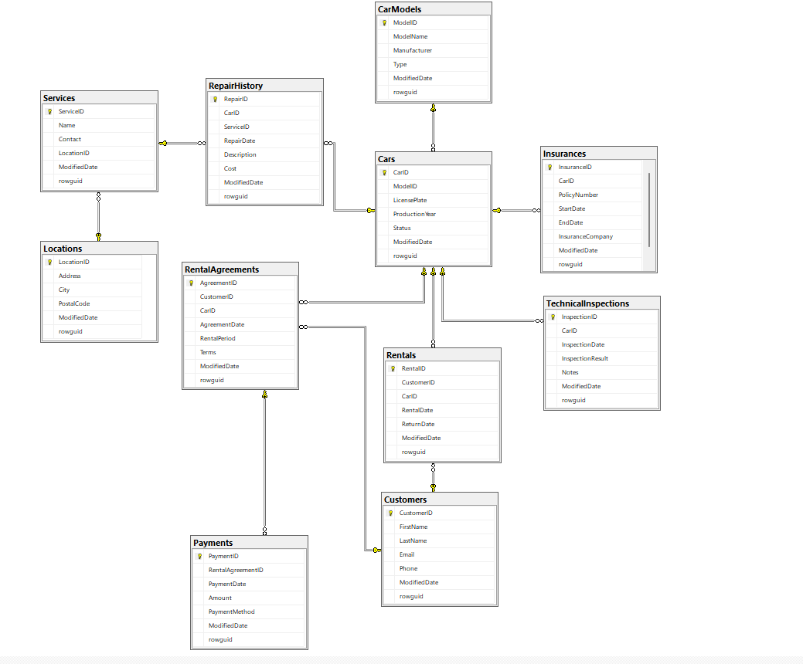

# Car Rental Database System

## 1. System Overview

The **Car Rental Database System** is designed to optimize and automate the management of vehicle fleets, clients, reservations, payments, and service history. The database enables efficient data storage and processing, allowing quick access to key information and real-time analytics.

Key functionalities include:
- **Reservation Management**: Create, update, and cancel rental bookings.
- **Vehicle Availability**: Track which cars are available for rent.
- **Rental History**: Record and review past rentals.
- **Technical Monitoring**: Store repair history, inspections, and insurance data.
- **Financial Reporting**: Generate revenue and cost reports.
- **Role-Based Access Control**: Secure data via user roles and permissions.

---

## 2. System Assumptions

- Support for concurrent rental transactions.
- Data integrity enforced with foreign keys, unique indexes, and constraints.
- Role-based permission system for secure access.
- Capability to generate financial and operational reports.
- Flexible schema for future extensions.
- Protection against unauthorized data access.

---

## 3. System Capabilities

- **Fleet Management**: Add/update car models and vehicles, modify status.
- **Client Management**: Store personal data and rental histories.
- **Rental Processing**: Record rentals, generate agreements, check availability.
- **Payment Tracking**: Log transactions and overdue payments.
- **Maintenance Tracking**: Record repairs, inspections, and insurance details.
- **Reporting**: Produce financial, maintenance, and operational reports.
- **Access Control**: Enforce permissions based on user roles.

---

## 4. Database Schema

See the **Database Schema Diagram** above (`schema.png`). It shows tables and their relationships:

- **CarModels** — ModelID, ModelName, Manufacturer, Type, ModifiedDate, rowguid  
- **Cars** — CarID, ModelID, LicensePlate, ProductionYear, Status, ModifiedDate, rowguid  
- **Clients** — CustomerID, FirstName, LastName, Email, Phone, ModifiedDate, rowguid  
- **Rentals** — RentalID, CustomerID, CarID, RentalDate, ReturnDate, ModifiedDate, rowguid  
- **RentalAgreements** — AgreementID, CustomerID, CarID, AgreementDate, RentalPeriod, Terms, ModifiedDate, rowguid  
- **Payments** — PaymentID, RentalAgreementID, PaymentDate, Amount, PaymentMethod, ModifiedDate, rowguid  
- **Locations** — LocationID, Address, City, PostalCode, ModifiedDate, rowguid  
- **Services** — ServiceID, Name, LocationID, Contact, ModifiedDate, rowguid  
- **RepairHistory** — RepairID, CarID, ServiceID, RepairDate, Description, Cost, ModifiedDate, rowguid  
- **Insurances** — InsuranceID, CarID, PolicyNumber, StartDate, EndDate, InsuranceCompany, ModifiedDate, rowguid  
- **TechnicalInspections** — InspectionID, CarID, InspectionDate, InspectionResult, Notes, ModifiedDate, rowguid  

---

## 5. Database Objects

### 5.1 Stored Procedures
- `sp_InsertCarModel`
- `sp_InsertCar`
- `sp_InsertClient`
- `sp_InsertRental`
- `sp_InsertService`
- `sp_InsertRepairHistory`
- `sp_InsertRentalAgreement`
- `sp_InsertPayment`
- `sp_InsertLocation`
- `sp_InsertInsurance`
- `sp_InsertTechnicalInspection`
- `sp_GenerateFinancialReport`
- `sp_CheckCarAvailability`
- `sp_GenerateRepairReport`
- `sp_UpdateCarStatus`

### 5.2 Functions
- `fn_CalcRentalCost`
- `fn_CheckCarAvailability`
- `fn_CalculateCarAge`
- `fn_IsInsuranceValid`
- `fn_IsTechnicalInspectionValid`

### 5.3 Triggers
- `trg_Cars_UpdateModifiedDate`
- `trg_Clients_UpdateModifiedDate`
- `trg_VehicleModels_UpdateModifiedDate`
- `trg_Rentals_UpdateModifiedDate`
- `trg_ServiceCenters_UpdateModifiedDate`
- `trg_RepairHistory_UpdateModifiedDate`
- `trg_RentalAgreements_UpdateModifiedDate`
- `trg_Payments_UpdateModifiedDate`
- `trg_Locations_UpdateModifiedDate`
- `trg_Insurances_UpdateModifiedDate`
- `trg_TechnicalInspections_UpdateModifiedDate`

### 5.4 Views
- `v_RentalDetails`
- `v_AvailableCars`
- `v_ClientRentals`
- `v_CarRepairHistory`

---

## 6. Roles & Permissions

| Role           | Assigned User     | Password           | Permissions                                                                      |
| -------------- | ----------------- | ------------------ | -------------------------------------------------------------------------------- |
| **ClientRole** | `ClientUser`      | `ClientPass123!`   | View available cars & own data; access `v_RentalDetails`, `v_AvailableCars`.     |
| **EmployeeRole** | `EmployeeUser`  | `EmployeePass123!` | Execute rental/agreement procedures; no direct table access.                     |
| **MechanicRole** | `MechanicUser`  | `MechanicPass123!` | Read/update `Services`, `RepairHistory`; view `v_CarRepairHistory`, `v_AvailableCars`. |
| **ManagerRole** | `ManagerUser`     | `ManagerPass123!`  | Read fleet, rentals, payments, agreements; access all key views.                |
| **AdminRole**   | `AdminUser`       | `AdminPass123!`    | Full database control (db_owner).                                                |

---

## 7. Quick Start

1. Restore or create `CarRentalDB` in SQL Server.
2. Run the SQL scripts in sequence:
   - **Schema** (tables, keys, indexes)
   - **Stored Procedures**, **Functions**, **Triggers**, **Views**
   - **Roles and Users** setup
   - **Seed Data** (optional)
3. Connect your application or run queries against `CarRentalDB`.

---

## 8. License & Contributing

Feel free to fork and extend this project. Please submit issues and pull requests via GitHub.

---
